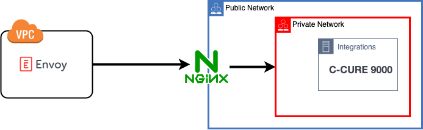

# About

HTTP Reverse proxys setup examples.
Using a reverse proxy allows for ingress establishment to your internal integrations (ie c-cure 9000)
without exposing other services on your network.

The examples documented in this repo aim to be functioning references. 
For production usage additional hardening steps 
need to be taken.

## http

This example uses Nginx to serve http requests to an upstream http service listening on 
arbitrary port. 

## http_ec2

Same as previous `http` example with additional steps to run in AWS EC2.

# Resources
- https://csrc.nist.gov/publications/detail/sp/800-44/version-2/final
