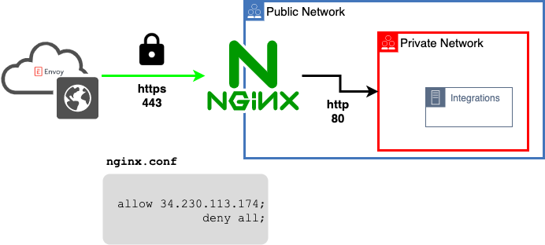

# HTTP Reverse proxys setup examples

Using a reverse proxy allows for ingress establishment to your internal integrations (ie c-cure 9000)
without exposing other services on your network.

The examples documented in this repo aim to be functioning references. 
For production usage additional hardening steps need to be taken on both the host server and your proxy (ie nginx).

## http

Nginx to serve http requests to an upstream http service listening on 
arbitrary port. 

## https

nginx configuration to terminate ssl at the proxy.

## http_ec2

Same as previous `http` example with additional steps to run in AWS EC2 on an ubuntu host.

## ccure

High level instructions to use nginx to proxy request to a C-CURE 9000 server.

# Resources
- https://csrc.nist.gov/publications/detail/sp/800-44/version-2/final
- https://csrc.nist.gov/publications/detail/sp/800-41/rev-1/final (2.1.5)
- https://ubuntu.com/server/docs/security-firewall
