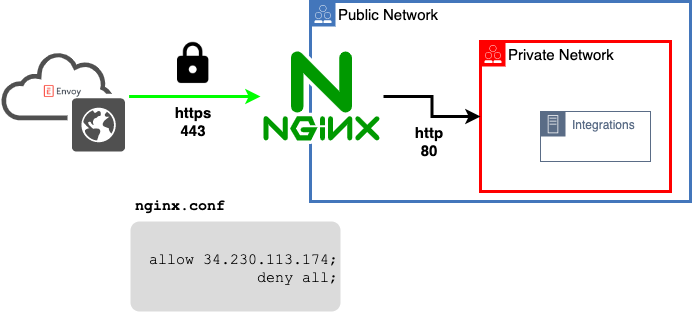

# HTTP Reverse proxy setup with Genetec Security Center integration

Real example configuration used to create/upgrade a Genetec Security Center
integration in Envoy. Envoy communicates with your on-prem Security Center
server through the Web SDK (WebSdk) REST API; the reverse proxy terminates SSL
and forwards requests to that internal server without exposing it directly.

- **upstream host**  172.31.53.136 (Genetec Security Center / WebSdk server private IP)
- **proxy dns record** genetecproxy.stagevoy.com



## Setup a reverse proxy

setup an https nginx proxy that accepts ssl connections and redirects http requests to https.

(example [https configurations](../https) )

### nginx.conf
```
user  nginx;
pid        /var/run/nginx.pid;

env HTTP_SERVICE;

events {
 worker_connections  1024;
}


http {
  resolver 127.0.0.11 ipv6=off;
  server {

    # nginx will route request to this $HTTP_SERVICE:$HTTP_SERVICE_PORT
    #
    set_by_lua $HTTP_SERVICE 'return os.getenv("HTTP_SERVICE")';

    ssl_certificate /etc/letsencrypt/live/genetecproxy.stagevoy.com/fullchain.pem; # managed by Certbot
    ssl_certificate_key /etc/letsencrypt/live/genetecproxy.stagevoy.com/privkey.pem; # managed by Certbot

    listen 443 ssl;
    listen 80;
    server_name genetecproxy.stagevoy.com;
    allow 34.230.113.174;
    deny all;
    location / {
       proxy_pass http://$HTTP_SERVICE;

   }

    if ($scheme != "https") {
        return 301 https://$host$request_uri;
    }
  }
}
```

### docker-compose.yml
```
version: "3"
services:
  nginx:
    image: fabiocicerchia/nginx-lua
    build:
      dockerfile: Dockerfile
      context: .
    container_name: nginx-http-reverse-proxy
    env_file:
      - nginx.env
    ports:
      - 80:80
      - 443:443
    volumes:
      - /etc/letsencrypt/:/etc/letsencrypt/:rw
      - ./nginx.conf:/etc/nginx/nginx.conf
```

### test your proxy

temporarily open your public network/internet device's firewall to accept connections from a safe IP.

```
wget  https://genetecproxy.stagevoy.com
```

### Set a whitelist on your proxy

Enforcing an IP whitelist is an added layer of security that will insure your integration is only accesible from known
agents (ie envoy's platform).

#### Get Envoy's outbound IP

Navigate to --> https://dashboard.envoy.com/integrations

Select Configure/Install on **Genetec**

Capture the IP listed under `Static IP #1` in the **API ACCESS** section

#### Update your nginx.conf

you can enforce a whitelist like:
```
 server {
    allow 34.230.113.174;
    deny all;
    location / {
       proxy_pass http://$HTTP_SERVICE;

   }
 }
```


restart your nginx server
```
docker-compose up
```

## Update your integration

Add your proxy dns entry to `Instance URL`

Click `Next Step`

check your nginx's server's logs to confirm the integration is updated
```
sudo docker logs nginx-http-reverse-proxy # check nginx logs
"POST /WebSdk/ HTTP/1.1" 200 38 "-" "-"
"GET /WebSdk/api/... HTTP/1.1" 200 38 "-" "-"
```
