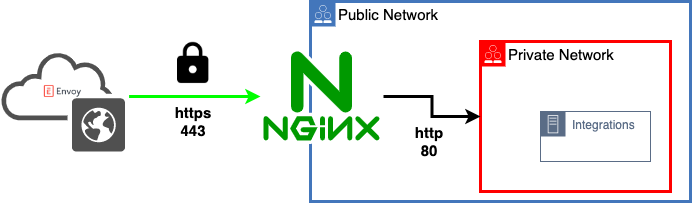

# About
> :warning:  **not suitable for production** : please use for testing/reference

This example will demonstrate using nginx to proxy requests to a http service.
Both nginx and the service share the same host in this example (localhost).

- **upsteam host:**  host running service nginx will proxy connections too
- **proxy host:**  host running nginx



## Files

```
├── Dockerfile # docker image used to run nginx
├── docker-compose.yml # docker container runtime settings
├── nginx.conf # nginx stanza to proxy requests to an upstream http service
└── nginx.env # enviroment variable used to template nginx.conf
```

## Prerequistes

- host with docker/docker-compose installed
- ingress between upstream and proxy hosts established

## Setup

### seed your environment (nginx.env)

```
tee -a nginx.env << END
HTTP_SERVICE_PORT=8000
HTTP_SERVICE=host.docker.internal
END
```

### run nginx

```
docker-compose up
```

### query your proxy

```
wget localhost:80
nc -zv localhost 80
```


### versions used
- Docker version 20.10.12, build e91ed57
- docker-compose version 1.29.2
- macOS 12.0.1 (21A559)
- zsh 5.8 (x86_64-apple-darwin21.0)
